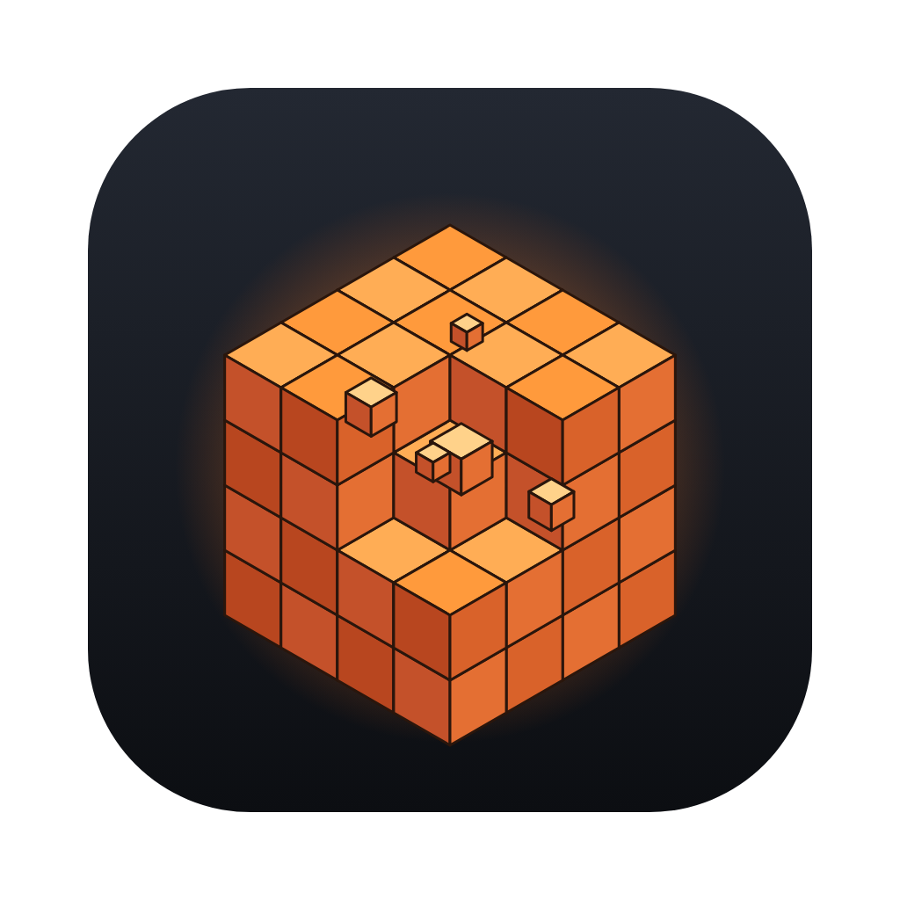

# Breakpoint

A fully destructible voxel heist game for macOS, inspired by Teardown. Every wall is a door: plan your route through a town where everything breaks, then grab the loot and reach the getaway van before the police arrive.



## Get the Mac app

1. Open the repository's **Actions** tab → the latest **Mac app** run → download the **Breakpoint-macOS** artifact.
   Tagged versions (`v*`) also attach the `.dmg` files to a GitHub Release.
2. Open `Breakpoint-<version>-arm64.dmg` (Apple Silicon) or `-x64.dmg` (Intel) and drag **Breakpoint** into Applications.
3. **First launch:** the app is ad-hoc signed, not notarised (that needs a paid Apple Developer account), so macOS will refuse to open it the first time. Either:
   - open **System Settings → Privacy & Security**, scroll down and click **Open Anyway**, or
   - run `xattr -dr com.apple.quarantine /Applications/Breakpoint.app` once in Terminal.

## How to play

You start in the **planning phase** with no clock: walk the town, blow holes, cut paths, stack things. The moment you grab a piece of loot (or set off the fire alarm by letting more than 200 voxels burn), a **60-second alarm** starts. Collect the three required items (blue markers), optionally the two bonus items (orange), then get into the green ring behind the red van.

| Loot | Where | How |
| --- | --- | --- |
| Ledger | Brick townhouse, top floor | Stairs, or make your own entrance |
| Server Drive | Office tower, 4th floor | Stairs, or a faster way up |
| Gold Bars | Bank vault | Sealed in steel: cutter, rockets or bombs |
| Antique Clock (bonus) | Barn hayloft | Stairs inside the barn |
| Radio Beacon (bonus) | Top of the water tower | Unreachable; bring the tower down |

**Controls**

| | |
| --- | --- |
| Move / sprint / jump / crouch | `WASD` · `Shift` · `Space` · `C` |
| Use tool | Left click (hold for cutter and extinguisher) |
| Carry / throw objects | Right click or `Q` to hold, left click to throw |
| Switch tool | `1`–`6` or mouse wheel |
| Grab loot | `E` |
| Pause | `Esc` |

**Tools:** sledgehammer (soft materials and some brick), shotgun (shreds glass, wood and plaster), pipe bombs (3 s fuse, bounce), rockets (breach steel), plasma cutter (cuts anything, limited fuel), extinguisher (put out fires before they trip the alarm).

## What's under the hood

- **Voxel world:** 256×64×256 voxels at 25 cm (64 m × 16 m × 64 m) with 27 materials and three hardness tiers. The town is generated from a seed ("New town" picks a different one).
- **Structural collapse:** after every hit, a flood fill finds anything that lost its connection to the ground and turns it into a rigid body.
- **Physics:** [Rapier](https://rapier.rs) (WebAssembly, SIMD) with native voxel colliders. Debris collides with the world and with other debris, stacks and sleeps. Hard impacts crack pieces further, and heavy pieces crush what they land on. You can pick up and throw light objects.
- **Fire:** wood, leaves and fabric burn, spread upwards and char or crumble, which can bring floors down.
- **Rendering:** three.js on WebGL 2, which runs on Metal on macOS. Highlights:
  - physically based materials with per-voxel roughness and metalness, baked ambient occlusion and bevelled voxel edges
  - sky-based image lighting, soft shadows, and height fog that picks up the sun's colour
  - 4× MSAA HDR rendering with bloom, so fire, sparks and freshly cut steel glow and cool down
  - smoke, dust, embers and dynamic fire and explosion lights
- **Tuned for Apple Silicon:**
  - MSAA instead of post-process anti-aliasing (cheap on tile-based GPUs)
  - shadow maps that re-render only when something moves
  - dynamic resolution to hold frame rate on Retina displays
  - chunk meshing on a worker pool across the CPU cores
  - fixed 60 Hz physics with interpolation, so motion stays smooth on 120 Hz ProMotion screens
- **Audio:** everything is synthesised at runtime, with 3D positional sound and an outdoor reverb.

The desktop app is a thin Electron shell (`electron/main.cjs`) that serves the game from a private `app://` origin. No server or network is used.

## Develop

Requires Node 22. The game itself has no runtime dependencies; three.js and Rapier are vendored in `vendor/`.

```sh
npm install        # Electron + electron-builder (dev only)
npm start          # dev server at http://localhost:5173 (any modern browser)
npm run app        # run the desktop app from source
npm test           # unit + physics tests (Node, headless)
npm run smoke      # plays a scripted mission in headless Chromium (needs Playwright)
npm run selftest   # boots the desktop app, triggers an explosion, checks for errors
npm run dist:mac   # build the .dmg (on a Mac; CI does this on every push)
```

Graphics presets live in the main menu. Auto picks **High** on Apple GPUs; **Ultra** adds ground-truth ambient occlusion (GTAO). The small grey line in the top-right of the HUD shows fps, CPU time per frame, render scale, active debris bodies and fires.

## Limitations

- It is not Teardown. There is no ray-traced lighting, no water, no vehicles and only one handcrafted mission layout, though the town can be reseeded.
- Graphics and performance were verified in a software renderer on Linux, not on a real Mac GPU. The shaders and settings are standard WebGL 2 that Metal handles well, but if anything looks or runs wrong on your Mac, the HUD's fps/CPU line is the first thing to report.
- Debris bodies are capped (about 180 at once); beyond that, the oldest resting pieces are frozen back into the world.
